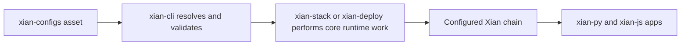

# xian-configs

`xian-configs` is the canonical repository for Xian network definitions and
committed chain assets. It hosts network manifests, genesis files, reusable
starter templates, and system-level contract assets. Other repos (`xian-cli`,
`xian-stack`, `xian-deploy`) read from
this repo as the source of truth for "which networks exist" and "what
contracts are part of canonical network state".

This repo is network-first and asset-centric. It does not contain node
runtime behavior, image build definitions, or operator command surfaces.

## Quick Start

Use this repo to:

- define or review a network manifest under `networks/`
- maintain committed contract assets under `contracts/`
- maintain reusable starter templates under `templates/`

Inspect the canonical templates from `xian-cli`:

```bash
uv run --project ../xian-cli xian network template list
uv run --project ../xian-cli xian network template show single-node-indexed
```

Validate manifests and contract assets locally:

```bash
uv run --project ../xian-cli    python ./scripts/validate-manifests.py
```

## Asset Model

`xian-configs` is intentionally data-heavy. It describes the assets that
other repos consume; it does not run nodes or build images itself.

| Asset type | Location | What it answers | Primary consumers |
| --- | --- | --- | --- |
| Network manifest | `networks/<name>/manifest.json` | Which chain exists, what its chain ID is, where genesis / snapshots / seed nodes / runtime settings come from | `xian-cli`, `xian-deploy`, `xian-stack` |
| Genesis and built-ins | `contracts/`, network assets | Which contracts are part of canonical committed chain state | `xian-abci`, `xian-cli` |
| Network template | `templates/*.json` | How to create a new local or operator-managed profile with sensible defaults | `xian-cli network create/join` |

The usual flow is:



Post-genesis products such as the DEX, NFT marketplace, stable protocol, and
reference SDK workflows live in their owning repos. They may consume a running
network created from this repo, but they are not part of this network catalog.

## Principles

- **Network-first.** This repo describes networks and committed chain
  assets, not node runtime behavior or image builds.
- **Templates are not live networks.** Reusable starter templates live separate
  from the manifests of real networks.
- **Products are repo-owned.** Post-genesis products and SDK examples are not
  described in this repo. Their owning repos keep their contract bundles,
  bootstrap scripts, app code, and tests.
- **Committed assets only when canonical.** Contract assets belong here when
  they are part of a canonical network or system-level generated asset. General
  runtime code and product bootstrap code live in the owning repos.
- **Explicit manifests, no implicit setup.** Anything a network depends on
  should be visible in a committed manifest, not inferred at deploy time.

## Key Directories

- `networks/` — manifests and genesis files for canonical networks
  (`devnet/`, `testnet/`, `local/`).
- `contracts/` — canonical contract manifests and source assets referenced by
  the networks above.
- `templates/` — reusable starter templates for creating purposeful Xian
  networks (`single-node-dev`, `single-node-indexed`, `consortium-5`).
- `contracts/templates/` — source templates used to generate reusable contract
  assets such as token-factory children.
- `scripts/` — validation helpers for manifests, templates, generated system
  assets, and contract bundles.
- `docs/` — repo-local architecture, backlog, and packaging notes.

## Main Consumers

- `xian-cli` — network creation, joining, contract-bundle validation, and
  generic client automation
- `xian-stack` — runtime images and local Compose-based operation; node images
  consume only core network assets from this repo
- `xian-deploy` — remote host deployment

## Validation

```bash
uv run --project ../xian-cli    python ./scripts/validate-manifests.py
```

The script validates manifest schemas, cross-references, generated system
artifacts, and committed network contract assets.

## Related Docs

- [AGENTS.md](AGENTS.md) — repo-specific guidance for AI agents and contributors
- [docs/README.md](docs/README.md) — index of internal docs
- [docs/ARCHITECTURE.md](docs/ARCHITECTURE.md) — major components and dependency direction
- [docs/BACKLOG.md](docs/BACKLOG.md) — open work and follow-ups
- [docs/PRIVACY_NETWORK_PACKAGING.md](docs/PRIVACY_NETWORK_PACKAGING.md) — packaging conventions for privacy-enabled networks
- [docs/VALIDATOR_DELEGATION.md](docs/VALIDATOR_DELEGATION.md) — validator delegation manifest model
