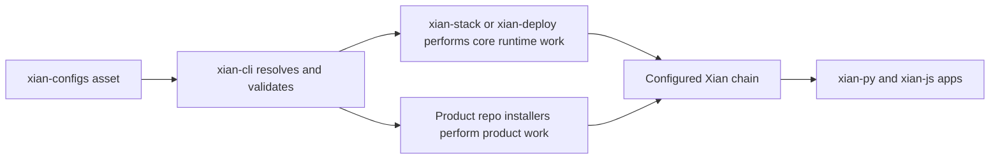

# xian-configs

`xian-configs` is the canonical repository for Xian network definitions and
committed chain assets. It hosts network manifests, genesis files, reusable
starter templates, optional product records, installable on-chain contract
packs, and complete reference examples. Other repos (`xian-cli`,
`xian-stack`, `xian-deploy`) read from
this repo as the source of truth for "which networks exist" and "what
contracts are part of them". Product records and contract packs are opt-in
post-genesis catalog assets, not node image contents.

This repo is network-first and asset-centric. It does not contain node
runtime behavior, image build definitions, or operator command surfaces.

## Quick Start

Use this repo to:

- define or review a network manifest under `networks/`
- maintain committed contract assets under `contracts/`
- maintain reusable starter templates under `templates/`
- publish optional product records under `products/`
- publish reusable installable contract packs under `contract-packs/`
- publish complete application / operator examples under `examples/`

Inspect the canonical templates from `xian-cli`:

```bash
uv run --project ../xian-cli xian network template list
uv run --project ../xian-cli xian network template show single-node-indexed
```

Validate manifests and contract assets locally:

```bash
uv run --project ../xian-cli    python ./scripts/validate-manifests.py
uv run --project ../xian-linter python ./scripts/validate-example-contracts.py
```

## Asset Model

`xian-configs` is intentionally data-heavy. It describes the assets that
other repos consume; it does not run nodes or build images itself.

| Asset type | Location | What it answers | Primary consumers |
| --- | --- | --- | --- |
| Network manifest | `networks/<name>/manifest.json` | Which chain exists, what its chain ID is, where genesis / snapshots / seed nodes / runtime settings come from | `xian-cli`, `xian-deploy`, `xian-stack` |
| Genesis and built-ins | `contracts/`, network assets | Which contracts are part of canonical committed chain state | `xian-abci`, `xian-cli` |
| Network template | `templates/*.json` | How to create a new local or operator-managed profile with sensible defaults | `xian-cli network create/join` |
| Product | `products/<name>/product.json` | Which optional product exists, which repo owns it, and how it is installed after genesis | `xian-cli product ...`, docs |
| Contract pack | `contract-packs/<name>/contract-pack.json` plus bundles | Which reusable protocol surface can be installed onto an existing network | `xian-cli contract-pack ...`, localnet harnesses |
| Example | `examples/<name>/example.json` | Which templates, contract packs, services, docs, and examples form a complete app starter | `xian-cli example ...`, docs |

The usual flow is:



For example, a local DEX demo starts from committed config data:

```bash
uv run --project ../xian-cli xian product show dex
uv run --project ../xian-cli xian contract-pack show dex
uv run --project ../xian-cli xian contract-pack validate dex
uv run --project ../xian-cli xian example starter dex-demo --flow local
```

When adding a new product, contract pack, or example, keep the source of truth
close to the owning repo:

- the owning product repo keeps canonical source and product-level tests
- `products/<name>/product.json` records the product boundary and post-genesis lifecycle
- this repo keeps the installable, hash-pinned manifest used by post-genesis installers
- `xian-cli` validates and installs that manifest
- `xian-docs-web` documents the user-facing workflow

## Principles

- **Network-first.** This repo describes networks and committed chain
  assets, not node runtime behavior or image builds.
- **Templates are not live networks.** Reusable starter templates and
  installable contract packs live separate from the manifests of real networks.
- **Products are opt-in.** Product records, product contract packs, and examples
  are available after a chain exists; they are not genesis inputs and are not
  copied into node images.
- **Committed assets only when canonical.** Contract assets belong here when
  they are part of a canonical network, a reusable contract pack, or an example.
  General runtime code lives in the runtime repos.
- **Explicit manifests, no implicit setup.** Anything a network depends on
  should be visible in a committed manifest, not inferred at deploy time.

## Key Directories

- `networks/` — manifests and genesis files for canonical networks
  (`devnet/`, `testnet/`, `local/`).
- `contracts/` — canonical contract manifests and source assets referenced by
  the networks above.
- `templates/` — reusable starter templates for creating purposeful Xian
  networks (`single-node-dev`, `single-node-indexed`, `consortium-5`).
- `contract-templates/` — source templates used to generate reusable contract
  assets such as token-factory children.
- `products/` — optional products with owning repos, component inventories,
  and explicit post-genesis lifecycle records (`dex/`, `stable-protocol/`,
  `nft/`).
- `contract-packs/` — reusable on-chain protocol or contract packs
  (`dex/`, `stable-protocol/`, `nft/`).
- `examples/` — complete app / operator patterns that compose templates,
  contract packs, services, app code, and docs (`credits-ledger`, `dex-demo`,
  `nft-marketplace`, `registry-approval`, `workflow-backend`).
- `scripts/` — validation helpers for manifests, products, contract packs, and examples.
- `docs/` — repo-local architecture, backlog, and packaging notes.

## Main Consumers

- `xian-cli` — network creation, joining, product inspection, contract pack
  install, and example starter flows
- `xian-stack` — runtime images and local Compose-based operation; node images
  consume only core network assets from this repo
- `xian-deploy` — remote host deployment

## Validation

```bash
uv run --project ../xian-cli    python ./scripts/validate-manifests.py
uv run --project ../xian-linter python ./scripts/validate-example-contracts.py
```

The first script validates manifest schemas and cross-references. The second
runs the contracting linter against committed contract assets.

## Related Docs

- [AGENTS.md](AGENTS.md) — repo-specific guidance for AI agents and contributors
- [docs/README.md](docs/README.md) — index of internal docs
- [docs/ARCHITECTURE.md](docs/ARCHITECTURE.md) — major components and dependency direction
- [docs/BACKLOG.md](docs/BACKLOG.md) — open work and follow-ups
- [docs/PRIVACY_NETWORK_PACKAGING.md](docs/PRIVACY_NETWORK_PACKAGING.md) — packaging conventions for privacy-enabled networks
- [docs/VALIDATOR_DELEGATION.md](docs/VALIDATOR_DELEGATION.md) — validator delegation manifest model
