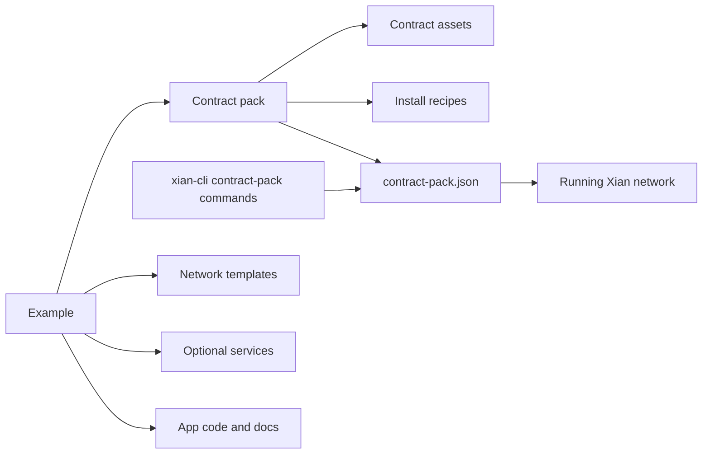

# Contract packs

Contract packs are reusable on-chain contract or protocol units that can be
installed onto a running Xian network.

They are lower-level than examples:

- a contract pack owns deployable contract assets and install recipes
- an example composes templates, contract packs, services, app code, and docs into a
  full application or operator workflow

Current contract packs:

- `dex/`: canonical Xian AMM contracts
- `stable-protocol/`: governance-owned stable-asset protocol contracts

Use `xian contract-pack list`, `xian contract-pack show <name>`, and
`xian contract-pack validate <name>` from `xian-cli`.
