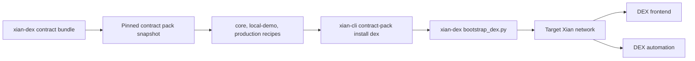

# DEX Contract Pack

This contract pack contains the canonical Xian AMM contract snapshot used by localnet,
automation, frontend, and integration-test flows.

Active development lives in `xian-dex`. This directory is a pinned catalog
snapshot for repeatable installs.

Recipes:

- `core`: deploy `con_pairs`, `con_dex`, and `con_dex_helper`
- `local-demo`: deploy the core contracts plus a demo token, LP token, and
  seeded XIAN/XDT pool
- `production`: deploy the core contracts without demo liquidity

Use the DEX demo example when you want the complete local frontend and
automation workflow.
