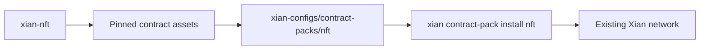

# NFT Contract Pack

The NFT contract pack is the pinned on-chain surface for the `xian-nft`
product. It contains the XSC-0005 checker contract and the reference
collection contract used by PixelSnek/local demos.

Source development, tests, frontend code, and bootstrap scripts live in
`xian-nft`. This directory keeps the reproducible contract snapshot consumed by
`xian-cli`.



Install onto an existing local network:

```bash
uv run --project ../xian-cli xian contract-pack install nft \
  --recipe reference-marketplace \
  --repo-dir ../xian-nft
```
