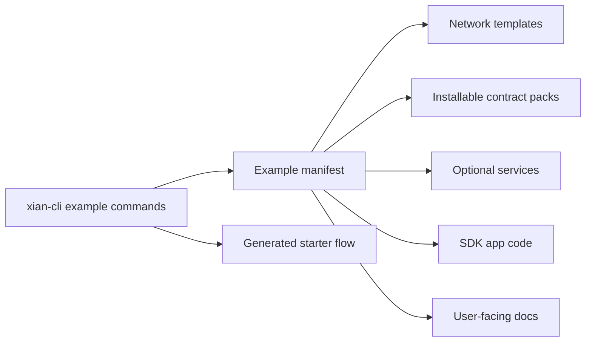

# Examples

Examples are complete application or operator patterns. They compose network
templates, contract packs, services, app code, and documentation into a usable flow.

Current examples:

- `credits-ledger/`
- `registry-approval/`
- `workflow-backend/`
- `dex-demo/`
- `nft-marketplace/`
- `x402-exact/`

Use `xian example list`, `xian example show <name>`, and
`xian example starter <name>` from `xian-cli`.
