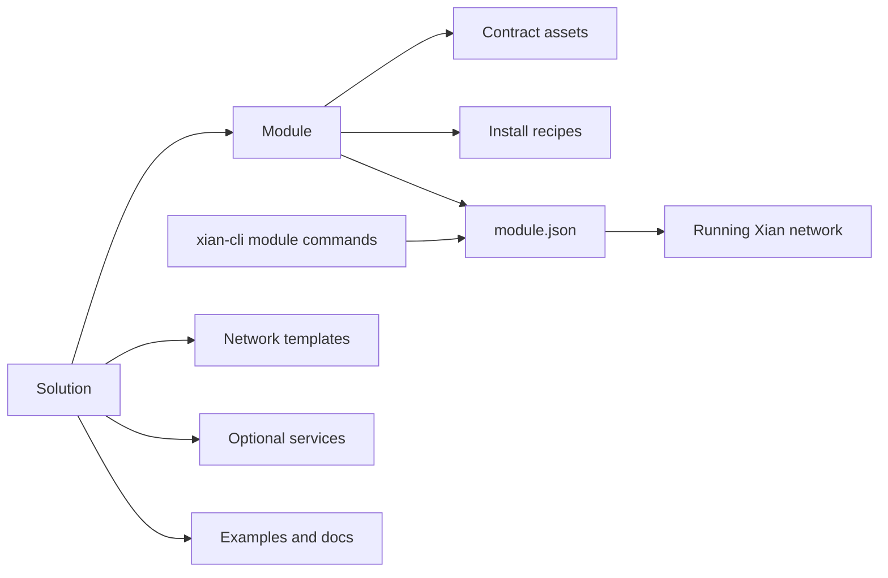

# Modules

Modules are reusable on-chain contract or protocol units that can be installed
onto a running Xian network.

They are lower-level than solutions:

- a module owns deployable contract assets and install recipes
- a solution composes templates, modules, services, examples, and docs into a
  full application or operator workflow

Current modules:

- `dex/`: canonical Xian AMM contracts
- `stable-protocol/`: governance-owned stable-asset protocol contracts

Use `xian module list`, `xian module show <name>`, and
`xian module validate <name>` from `xian-cli`.
