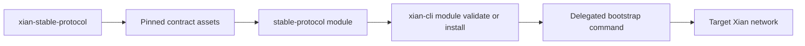

# Stable Protocol Module

This module contains the pinned stable-protocol contract assets. Active
development and deployment bootstrap scripts live in `xian-stable-protocol`.

The module exists so tooling can discover and validate the protocol contract
set separately from solution starter flows.

Use `xian module validate stable-protocol` to validate the pinned bundle.

Use `xian module install stable-protocol --dry-run` to resolve the delegated
bootstrap command in `xian-stable-protocol`. For a real install, prepare the
owning repo's bootstrap environment variables and rerun without `--dry-run`.
