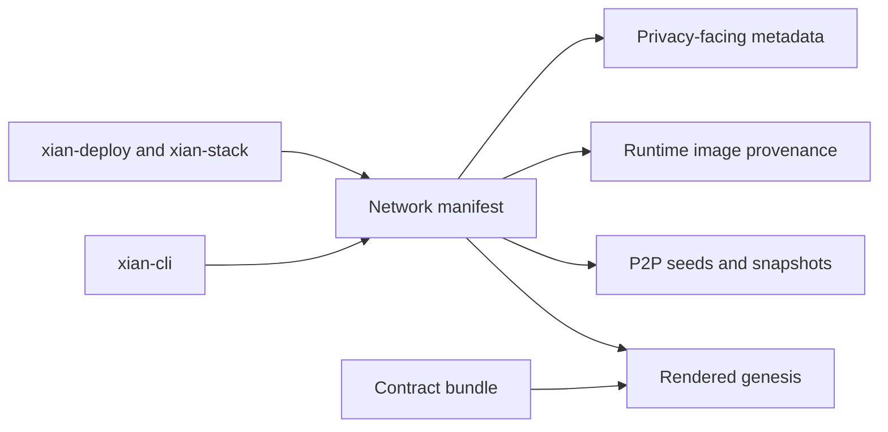

# Network Bundles

## Purpose
- This folder contains canonical bundle manifests used to build deterministic
  test and development networks.

## Contents
- one directory per supported genesis bundle
- manifest data only; genesis is rendered from the bundle's contract bundle

## Notes
- Keep bundle-owned data here, not in `xian-abci` or `xian-cli`.
- Bundle genesis is rendered from the matching contract bundle under
  `contracts/contracts_<bundle>.json`.
- Validator policy for active bundles is pinned explicitly in those bundles so
  the bundle behavior does not depend on hidden contract defaults.
- The canonical `testnet` bundle is also the richest real-network fixture: it
  pins published node images and release provenance while still deriving fresh
  deterministic genesis from the current contract bundle.
- Networks can also pin privacy-facing metadata here:
  - `privacy_artifact_catalog`: a checksum-pinned catalog of approved shielded
    registry manifests for that network
  - `shielded_history_policy`: the network's compatibility and retention
    commitment for `shielded_wallet_history`
  - `privacy_submission_policy`: operator-facing policy for relayer auth and
    hidden-sender submission posture

