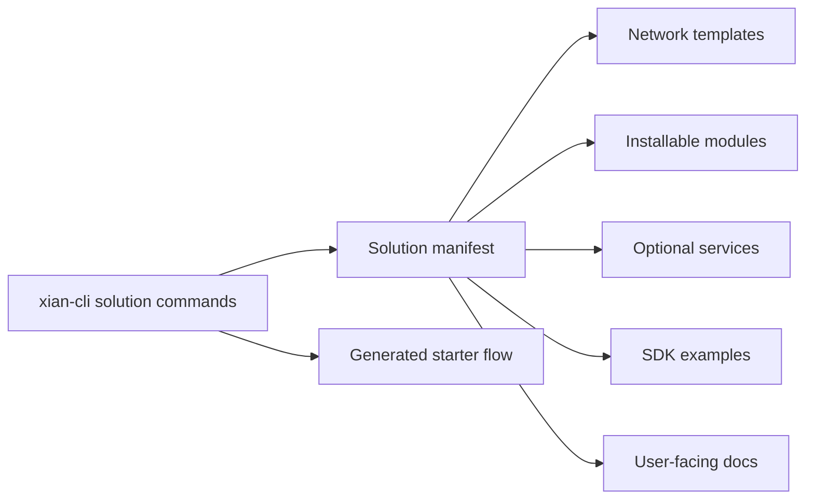

# Solutions

Solutions are complete application or operator patterns. They compose network
templates, modules, services, examples, and documentation into a usable flow.

Current solutions:

- `credits-ledger/`
- `registry-approval/`
- `workflow-backend/`
- `dex-demo/`
- `x402-exact/`

Use `xian solution list`, `xian solution show <name>`, and
`xian solution starter <name>` from `xian-cli`.
