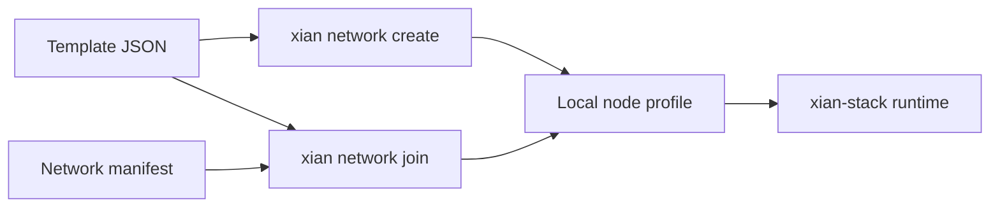

# Templates

## Purpose
- This folder contains canonical starter templates for creating purposeful new
  Xian networks and operator node profiles.

## Contents
- one JSON file per template
- network defaults such as block policy and tracer mode
- node execution defaults such as speculative parallel execution
- bootstrap profile defaults such as BDS, dashboard, and monitoring behavior
- operator intent metadata such as `operator_profile` and
  `monitoring_profile`
- creation conveniences such as a default bootstrap validator name

## Notes
- Templates are not live network manifests.
- `xian-cli` consumes these files for `network template ...`,
  `network create --template ...`, and `network join --template ...`.
- `operator_profile` expresses the intended operator posture for the template:
  local development, indexed development, or shared network.
- `monitoring_profile` expresses how the template expects monitoring to work:
  `none`, `local_stack`, or `bds`.
- `services` contains the sidecars that the generated node profile should
  enable. `services.bds.enabled` controls the Blockchain Data Service.
- `advanced` contains template-specific low-level runtime overrides. The
  starter templates bind application metrics to `0.0.0.0` inside containers;
  stack and deploy host-publish settings still control public exposure.

## Typical Use
- Choose a template when creating a fresh local or operator-managed network.
- Choose the matching template again when joining a network into a local
  profile.
- Treat these files as reusable defaults, not as live network state.

